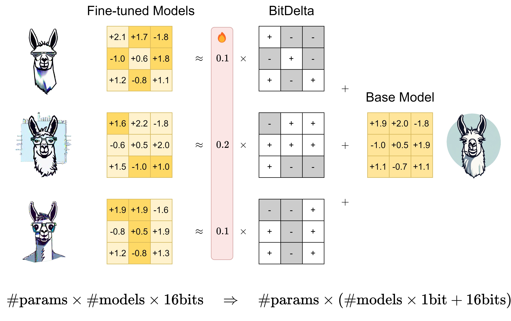

# BitDelta: Your Fine-Tune May Only Be Worth One Bit

[[Paper](https://arxiv.org/abs/2402.10193)][[Blog](https://fasterdecoding.github.io/BitDelta/)]

BitDelta compresses the weight delta between a fine-tuned and base model LLM to 1 bit, enabling accurate and efficient multi-tenant serving.

<div align="center">
    
      <a href="https://github.com/FasterDecoding/BitDelta/assets/51351043/b7840fab-0d75-4829-8993-1e5d586698a0">
  </a>
</div>

The current release supports:

- Llama-2 and Mistral based models.
- Memory efficient 16-bit + 1-bit Δ Linear in PyTorch
- Triton kernel for fast inference
- Gradio demo showcasing batched inference over 6 Mistral-7B based models, using only **30 GB** of GPU memory!

## News

- [02/2024] 🔥 Arxiv release!

## Abstract

Large Language Models (LLMs) are typically trained in two phases: pre-training on large internet-scale datasets, and fine-tuning for downstream tasks. Given the higher computational demand of pre-training, it's intuitive to assume that fine-tuning adds less new information to the model, and is thus more compressible. We explore this assumption by decomposing the weights of fine-tuned models into their pre-trained components and an additional delta. We introduce a simple method, BitDelta, which successfully quantizes this delta down to 1 bit without compromising performance. This interesting finding not only highlights the potential redundancy of information added during fine-tuning, but also has significant implications for the multi-tenant serving and multi-tenant storage of fine-tuned models. By enabling the use of a single high-precision base model accompanied by multiple 1-bit deltas, BitDelta dramatically reduces GPU memory requirements by more than 10x, which can also be translated to enhanced generation latency in multi-tenant settings. We validate BitDelta through experiments across Llama-2 and Mistral model families, and on models up to 70B parameters, showcasing minimal performance degradation over all tested settings.

## Contents

- [Install](#Install)
- [Demo](#Demo)
- [Usage](#Usage)
- [Citation](#citation)

## Install

1. Clone the repo and navigate to BitDelta:

```
git clone https://github.com/FasterDecoding/BitDelta
cd BitDelta
```

2. Set up environment:

```bash
conda create -yn bitdelta python=3.9
conda activate bitdelta

pip install -e .
```

## Demo

See [`demo/README.md`](https://github.com/FasterDecoding/BitDelta/blob/main/demo/README.md) for instructions on how to set up the demo.

[BitDelta Demo.webm](https://github.com/FasterDecoding/BitDelta/assets/51351043/b56747df-1108-42f2-ae6f-05e1c460080c)

## Usage

We provide some scripts in (`./scripts`) so you can compress your own models! As an example, we will compress `lmsys/vicuna-7b-v1.5` with base model `meta-llama/Llama-2-7b-hf`.

### Compress Model

Compress the weight delta and perform scale distillation:

```
CUDA_VISIBLE_DEVICES=0,1 python \
    bitdelta/train.py \
    --base_model meta-llama/Llama-2-7b-hf \
    --finetuned_model lmsys/vicuna-7b-v1.5 \
    --save_dir $MODEL_SAVE_DIR \
    --batch_size 4 \
    --num_steps 200 \
    --save_full_model True
```

where `$MODEL_SAVE_DIR` is specified.

If `--save_full_model` is specified, the compressed model will also be saved in HuggingFace format at `$MODEL_SAVE_DIR/calibrated_model`. Otherwise, only the delta will be saved.

### Perplexity Check

Double check the perplexity of the compressed model:

```
CUDA_VISIBLE_DEVICES=0 python \
    bitdelta/eval_ppl.py \
    --base_model meta-llama/Llama-2-7b-hf \
    --dataset_name wikitext \
    --subset wikitext-2-raw-v1 \
    --save_dir $PPL_SAVE_DIR \
    --num_eval_samples 100 \
    --model_diff $MODEL_SAVE_DIR/diff.pt \

```

### Replicate Results

To replicate our other results, please use `--save_full_model` to run the model in Llama format for compatibility with eval harnesses.

## Citation

If you find BitDelta useful, please consider citing:

```
@misc{liu2024bitdelta,
      title={BitDelta: Your Fine-Tune May Only Be Worth One Bit},
      author={James Liu and Guangxuan Xiao and Kai Li and Jason D. Lee and Song Han and Tri Dao and Tianle Cai},
      year={2024},
      eprint={2402.10193},
      archivePrefix={arXiv},
      primaryClass={cs.LG}
}
```

[# Compressing Model Diffs for High-Througput Multi-Model Serving]: #
